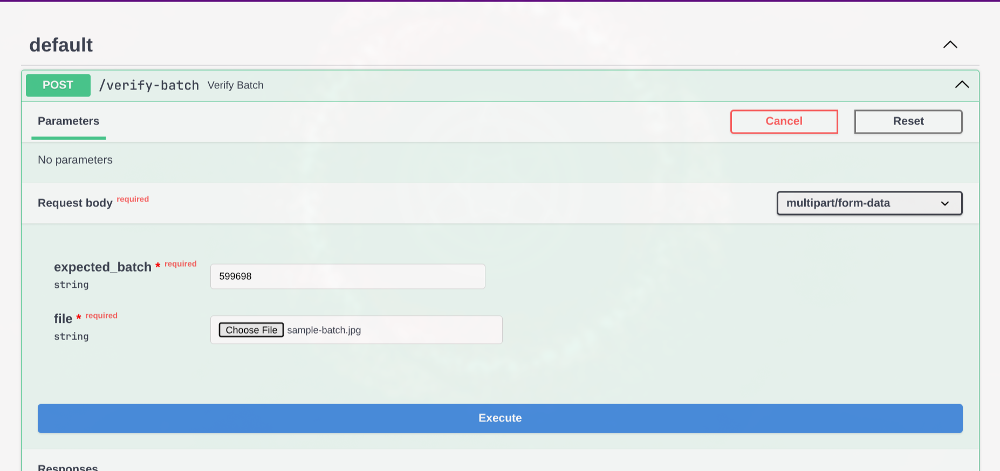
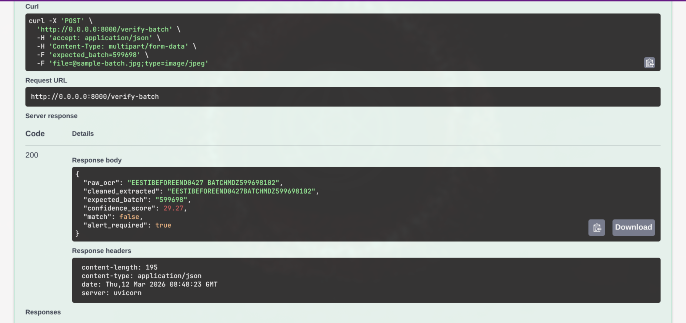

# 🔍 Batch Verification API

> A high-performance QA microservice built with **FastAPI**, **OpenCV**, and **EasyOCR** for automated verification of batch and lot numbers on packaging and manufacturing lines.

[](https://www.python.org/)
[](https://fastapi.tiangolo.com/)
[](https://opencv.org/)
[](https://github.com/JaidedAI/EasyOCR)
[](https://www.docker.com/)

---

## 📌 Overview

In modern manufacturing, verifying that dot-matrix or inkjet lot and batch codes match production baselines is essential to prevent costly mislabeling and non-conformance incidents. 

The **Batch Verification API** acts as an automated Quality Assurance (QA) microservice designed for seamless integration with factory-floor **Device Monitoring Operations (DMO)** and **PLC** systems. High-resolution line camera captures are processed through a computer vision enhancement pipeline, parsed via deep-learning OCR with constrained character sets, and evaluated using fuzzy string matching to instantly flag discrepancies and trigger line-stop alerts.

---

## 🚀 Key Features

* **⚡ FastAPI Microservice:** Asynchronous, lightweight, and auto-generating interactive Swagger API documentation (`/docs`).
* **👁️ Computer Vision Preprocessing:** Enhances low-contrast dot-matrix print on curved or reflective surfaces using OpenCV Grayscale and **CLAHE** (*Contrast Limited Adaptive Histogram Equalization*).
* **🔠 Constrained Deep-Learning OCR:** Powered by EasyOCR with alphanumeric allowlists (`[A-Z0-9]`), magnification tuning (`mag_ratio=2.5`), and adaptive contrast thresholds.
* **🎯 Fuzzy Verification Engine:** Sanitizes inputs and calculates sequence similarity scores using `difflib.SequenceMatcher` against a configurable 90% confidence threshold.
* **🚨 Automated Discrepancy Alerting:** Real-time boolean triggers (`alert_required: true`) and structured production audit trails for immediate automated line stoppage.
* **🏭 DMO Integration Simulation:** Includes a standalone client simulator (`mock-dmo.py`) demonstrating end-to-end factory-floor integration.
* **🐳 Fully Containerized:** Dockerized build with pre-configured system libraries (`libglib2.0-0`) to avoid PyTorch and OpenCV dependency conflicts.

---

## 📸 See It In Action

<p align="center">
  
  <br>
  <em>Interactive Swagger UI documentation generated automatically by FastAPI.</em>
</p>

<p align="center">
  
  <br>
  <em>The verification engine catching an alphanumeric mismatch and triggering an automated DMO alert.</em>
</p>

---

## 🏗️ Architecture & Verification Pipeline

```
 ┌──────────────────────┐
 │  Camera / DMO Client │  (Snaps photo on manufacturing line)
 └──────────┬───────────┘
            │  POST /verify-batch (Multipart: image + expected_batch)
            ▼
 ┌──────────────────────┐
 │  FastAPI Controller  │  (Validates payload & decodes image buffer)
 └──────────┬───────────┘
            │
            ▼
 ┌──────────────────────┐
 │  OpenCV CLAHE Engine │  (Grayscale + Contrast Limited Adaptive Histogram Equalization)
 └──────────┬───────────┘
            │
            ▼
 ┌──────────────────────┐
 │  EasyOCR Recognition │  (Constrained alphanumeric allowlist [A-Z0-9], 2.5x magnification)
 └──────────┬───────────┘
            │
            ▼
 ┌──────────────────────┐
 │ Sanitization & Fuzzy │  (Normalizes characters & runs SequenceMatcher >= 90% threshold)
 └──────────┬───────────┘
            │
            ▼
 ┌──────────────────────┐
 │ Verdict & DMO Alert  │  (Returns JSON: match, confidence_score, alert_required)
 └──────────────────────┘
```

---

## 🛠️ Tech Stack

* **Language:** Python 3.10+
* **Framework:** [FastAPI](https://fastapi.tiangolo.com/)
* **ASGI Server:** [Uvicorn](https://www.uvicorn.org/)
* **Image Processing:** [OpenCV (cv2)](https://opencv.org/) & [NumPy](https://numpy.org/)
* **OCR Engine:** [EasyOCR](https://github.com/JaidedAI/EasyOCR) (PyTorch backend)
* **Matching Algorithm:** `difflib.SequenceMatcher` & Regular Expressions
* **Containerization:** [Docker](https://www.docker.com/)

---

## ⚙️ Installation & Quickstart

You can run this project using Docker (recommended) or in a local Python environment.

### Option 1: Running with Docker (Recommended)

Docker provides an isolated environment with all OpenCV and EasyOCR runtime dependencies pre-configured.

1. **Clone the repository:**
   ```bash
   git clone https://github.com/zq-ubuntu/batch-verification.git
   cd batch-verification
   ```

2. **Build the Docker image:**
   ```bash
   docker build -t batch-verification .
   ```

3. **Run the container:**
   ```bash
   docker run -d -p 8000:8000 --name batch-verifier batch-verification
   ```

4. **Verify the container is running:**
   Navigate to [http://localhost:8000/docs](http://localhost:8000/docs) in your browser.

---

### Option 2: Local Python Setup

1. **Clone the repository:**
   ```bash
   git clone https://github.com/zq-ubuntu/batch-verification.git
   cd batch-verification
   ```

2. **Install system dependencies (Linux/Debian):**
   ```bash
   sudo apt-get update && sudo apt-get install -y libglib2.0-0 libsm6 libxrender1 libxext6
   ```

3. **Create and activate a virtual environment:**
   ```bash
   python3 -m venv venv
   source venv/bin/activate
   ```

4. **Install dependencies:**
   ```bash
   pip install --upgrade pip
   pip install -r requirements.txt
   ```

5. **Start the API server:**
   ```bash
   uvicorn main:app --host 0.0.0.0 --port 8000 --reload
   ```
   Or execute directly:
   ```bash
   python main.py
   ```

---

## 📖 API Reference

### `POST /verify-batch`

Verifies a captured product image against the expected batch number.

#### Request (Multipart Form Data)

| Field | Type | Description | Required |
| :--- | :--- | :--- | :--- |
| `expected_batch` | `string` | The baseline / expected batch number string (e.g. `"599698"`) | **Yes** |
| `file` | `UploadFile` | Image file (`.jpg`, `.png`, etc.) containing the printed batch code | **Yes** |

#### Example cURL Request

```bash
curl -X 'POST' \
  'http://localhost:8000/verify-batch' \
  -H 'accept: application/json' \
  -H 'Content-Type: multipart/form-data' \
  -F 'expected_batch=599698' \
  -F 'file=@sample-batch.jpg;type=image/jpeg'
```

#### Response (JSON)

##### ✅ Successful Verification (Match)
```json
{
  "raw_ocr": "BATCH NO 599698",
  "cleaned_extracted": "BATCHNO599698",
  "expected_batch": "599698",
  "confidence_score": 92.5,
  "match": true,
  "alert_required": false
}
```

##### ❌ Mismatch Detected (Alert Triggered)
```json
{
  "raw_ocr": "EESTIBEFOREEND0427 BATCHMDZ599698102",
  "cleaned_extracted": "EESTIBEFOREEND0427BATCHMDZ599698102",
  "expected_batch": "599698",
  "confidence_score": 29.27,
  "match": false,
  "alert_required": true
}
```

#### Response Fields Description

* `raw_ocr` *(string)*: Unprocessed string output returned by EasyOCR.
* `cleaned_extracted` *(string)*: Uppercase alphanumeric characters extracted from the OCR result.
* `expected_batch` *(string)*: Sanitized baseline string provided in the request.
* `confidence_score` *(float)*: Percentage similarity calculated using SequenceMatcher ($0.00 - 100.00\%$).
* `match` *(boolean)*: `true` if confidence score $\ge 90\%$, otherwise `false`.
* `alert_required` *(boolean)*: Inverted match flag. When `true`, downstream systems should stop the line or quarantine the unit.

---

## 🏭 Simulating Factory Floor Integration (DMO)

The repository includes `mock-dmo.py`, which simulates an automated packaging line PLC/DMO inspecting bottles:

1. Ensure the microservice is running on port 8000.
2. Run the simulation:
   ```bash
   python mock-dmo.py
   ```

### Simulation Output Example

```text
⚙️ DMO SYSTEM: Bottle detected on line. Expected batch is 599698.
⚙️ DMO SYSTEM: Snapping photo and sending to QA Microservice...

--- DMO RECEIVED RESPONSE FROM MICROSERVICE ---
{
    "raw_ocr": "EESTIBEFOREEND0427 BATCHMDZ599698102",
    "cleaned_extracted": "EESTIBEFOREEND0427BATCHMDZ599698102",
    "expected_batch": "599698",
    "confidence_score": 29.27,
    "match": false,
    "alert_required": true
}

🚨 DMO SYSTEM: MISMATCH DETECTED! STOPPING LINE 3 AND LOGGING NON-CONFORMANCE! 🚨
```

---

## 📁 Project Structure

```text
batch-verification/
├── Dockerfile             # Container definition with OpenCV runtime
├── main.py                # FastAPI microservice & OCR verification pipeline
├── mock-dmo.py            # Simulated manufacturing line client
├── requirements.txt       # Python dependencies
├── sample-batch.jpg       # Sample test image of a bottle neck print
├── screenshot/            # UI screenshots for API documentation
│   ├── img-01.png         # Swagger UI verification endpoint
│   └── img-02.png         # Swagger UI response and alert payload
└── README.md              # Project documentation
```

---

## 🔧 Tuning & Customization

* **Image Enhancement:** Modify `enhance_image_for_easyocr()` in [`main.py`](main.py) to tweak CLAHE `clipLimit` and `tileGridSize` depending on lighting and surface curvature.
* **Match Threshold:** Adjust the similarity cutoff ratio in `validate_batch_number()` (default: `0.90` / `90%`).
* **Multi-Language OCR:** Initialize `easyocr.Reader(['en', ...])` with additional languages as needed.

---

## 📄 License

This project is licensed under the MIT License — feel free to modify and adapt it for your production environments.
